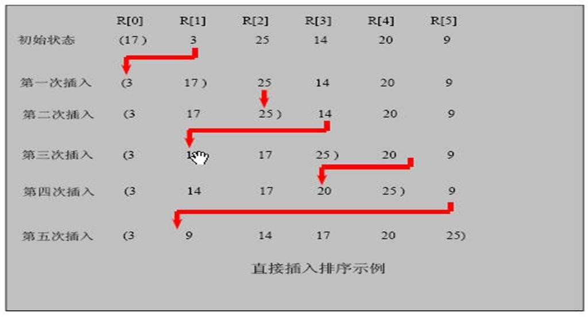

## 插入排序

### 介绍

插入式排序属于内部排序法，是对于欲排序的元素以插入的方式找寻该元素的适当位置，以达到排序的目的。

### 插入排序法思想

插入排序（Insertion Sorting）的基本思想是：把 n 个待排序的元素看成为一个有序表和一个无序表，
开始时有序表中只包含一个元素，无序表中包含有 n-1 个元素，排序过程中每次从无序表中取出第一个元素，
把它的排序码依次与有序表元素的排序码进行比较，将它插入到有序表中的适当位置，使之成为新的有序表。

### 插入排序思路图



### 插入排序法应用实例

有一群小牛, 考试成绩分别是  101, 34, 119, 1	请从小到大排序

```java
public class InsertSort {
    public static void main(String[] args) {
        //int[] array = {101, 34, 119, 1};
        int[] array = SortUtils.createArray(800, 20000);
        SortUtils.sysBefore(array);
        insertSort(array);
        SortUtils.sysAfter(array);
    }

    private static void insertSort(int[] array) {
        int insertVal ;
        int insertIndex ;
        for (int i = 1; i < array.length; i++) {
            insertVal = array[i];
            //获取 array[i] 之前的数据
            insertIndex = i-1;
            // 给 insertVal 找寻插入的位置
            // 1. insertIndex >= 0 保证在给insertVal 找插入的位置，不越界
            // 2. insertVal < array[insertIndex] 待插入的数。还没找到插入的位置
            // 3. 将array[insertIndex] 后移
            while (insertIndex >=0 && insertVal < array[insertIndex]){
                array[insertIndex + 1] = array[insertIndex];
                insertIndex--;
            }
            // 当退出 while 循环时，说明插入的位置找到, insertIndex + 1
            // 举例：理解不了，我们一会 debug
            //这里我们判断是否需要赋值
            if(insertIndex + 1 != i) {
                array[insertIndex + 1] = insertVal;
            }
        }
    }
}
```

 