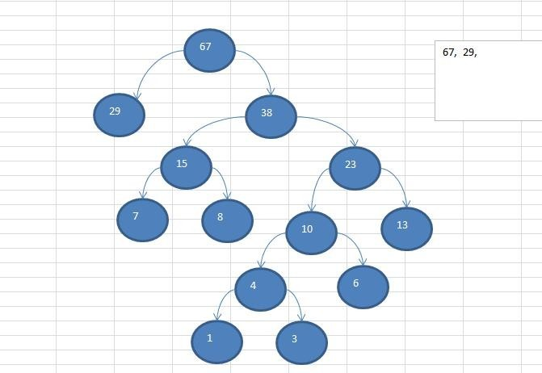

## 赫夫曼树

### 介绍

1)	给定 n 个权值作为 n 个叶子结点，构造一棵二叉树，若该树的带权路径长度(wpl)达到最小，称这样的二叉树为最优二叉树，也称为哈夫曼树(Huffman Tree), 还有的书翻译为霍夫曼树。
2)	赫夫曼树是带权路径长度最短的树，权值较大的结点离根较近
###	赫夫曼树几个重要概念和举例说明

1)	路径和路径长度：在一棵树中，从一个结点往下可以达到的孩子或孙子结点之间的通路，称为路径。通路
中分支的数目称为路径长度。若规定根结点的层数为 1，则从根结点到第 L 层结点的路径长度为 L-1
2)	结点的权及带权路径长度：若将树中结点赋给一个有着某种含义的数值，则这个数值称为该结点的权。结点的带权路径长度为：从根结点到该结点之间的路径长度与该结点的权的乘积
3)	树的带权路径长度：树的带权路径长度规定为所有叶子结点的带权路径长度之和，记为 WPL(weighted path length) ,权值越大的结点离根结点越近的二叉树才是最优二叉树。
4)	WPL 最小的就是赫夫曼树


### 赫夫曼树创建思路图解

给你一个数列 {13, 7, 8, 3, 29, 6, 1}，要求转成一颗赫夫曼树.

- 思路分析(示意图)：
{13, 7, 8, 3, 29, 6, 1}

构成赫夫曼树的步骤：
1)	从小到大进行排序, 将每一个数据，每个数据都是一个节点 ， 每个节点可以看成是一颗最简单的二叉树
2)	取出根节点权值最小的两颗二叉树
3)	组成一颗新的二叉树, 该新的二叉树的根节点的权值是前面两颗二叉树根节点权值的和
 
4)	再将这颗新的二叉树，以根节点的权值大小  再次排序，  不断重复	1-2-3-4 的步骤，直到数列中，所有的数据都被处理，就得到一颗赫夫曼树
5)	图解:



### 代码实现

```java
public class HuffManTree {
    public static void main(String[] args) {
        int[] array = {13, 7, 8, 3, 29, 6, 1 };
        Node huffmanTree = createHuffmanTree(array);
        preOrder(huffmanTree);
    }

    /**
     * 编写一个前序遍历的方法
     * @param root
     */
    public static void preOrder(Node root) {
        if (root != null) {
            root.preOrder();
        } else {
            System.out.println("是空树，不能遍历~~");
        }
    }

    /**
     * <p>
     *       构建一个赫夫曼树
     * </p>
     * @version 1.0.0
     * @since 12/31/2020
     * @param array     需要构建的数组
     * @return Node 构建后的赫夫曼树
     */
    public static Node createHuffmanTree(int[] array) {
        // 第一步为了操作方便
        // 1.  遍历 arr 数组
        // 2.  将 arr 的每个元素构成成一个 Node
        // 3.  将 Node 放入到 ArrayList 中
        List<Node> nodes = new ArrayList<Node>();
        for (int value : array) {
            nodes.add(new Node(value));
        }
        while (nodes.size() > 1) {
            //排序 从小到大
            Collections.sort(nodes);
            System.out.println("nodes =" + nodes);
            //取出根节点权值最小的两颗二叉树
            //(1) 取出权值最小的结点（二叉树）
            Node leftNode = nodes.get(0);
            //(2) 取出权值第二小的结点（二叉树）
            Node rightNode = nodes.get(1);
            //(3)构建一颗新的二叉树
            Node parent = new Node(leftNode.getValue() + rightNode.getValue());
            parent.setLeft(leftNode);
            parent.setRight(rightNode);
            //(4)从 ArrayList 删除处理过的二叉树
            nodes.remove(leftNode);
            nodes.remove(rightNode);
            //(5)将 parent 加入到 nodes
            nodes.add(parent);
        }
        return nodes.get(0);

    }

}

@Getter
@Setter
class Node implements Comparable<Node> {

    private int value;
    private Node left;
    private Node right;

    Node(int value) {
        this.value = value;
    }

    /**
     * 前序遍历
     */
    public void preOrder() {
        System.out.println(this);
        if (this.left != null) {
            this.left.preOrder();
        }
        if (this.right != null) {
            this.right.preOrder();
        }
    }

    @Override
    public int compareTo(Node o) {
        // 表示从小到大排序
        return this.value - o.value;
    }

    @Override
    public String toString() {
        return "Node{" +
                "value=" + value +
                '}';
    }

}
```


